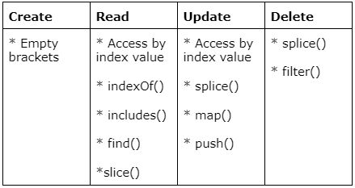

# Dynamic Array Manipulation

In JavaScript, you can create, read, update and remove items from an array in mutliple ways. Here are "tried-and-true" approaches for each operation.

Here is a table summarizing each approach:




## 1) Create an array
<br>
You can initialize an array by declaring square brackets.

```js
let arr = []
```

## 2) Reading an array
<br>

* Read a single item by it's index value

    ```js
    let arr = ['cat', 'chicken', 'dog']
    
    arr[1]

    // returns 'chicken'
    ```

* Read a single item's index value

    ```js
    let arr = ['cat', 'chicken', 'dog']

    arr.indexOf('dog')
    
    // returns 2
    ```

* Read array to determine if a single item exists

    ```js
    let arr = ['cat', 'chicken', 'dog']

    arr.includes('cat') 
    
    // returns true
    ```

* Read array to locate and return a single item by conditional statement

    ```js
    let arr = ['cat', 'chicken', 'dog']

    arr.find(animal => animal === 'cat') 

    // returns 'cat'
    ```

* Read multiple items in an array with a start index value and end index value

    ```js
    let arr = ['cat', 'chicken', 'dog', 'duck']

    arr.slice(1,3) 

    // returns ['chicken', 'dog']
    ```

## 3) Update an array
<br>

* Update a single item in an array by it's index value

    ```js
    let arr = ['cat', 'chicken', 'dog']

    arr[1] = 'duck'

    // arr now equals ['cat', 'duck', 'dog']
    ```

* Update multiple items in an array

    ```js
    let arr = ['cat', 'chicken', 'dog']

    arr.splice(1, 2, 'duck', 'mouse')

    // arr now equals ['cat', 'duck', 'mouse']
    ```

* Update every item in an array

    ```js
    let arr = ['cat', 'chicken', 'dog']

    arr.map(animal => animal + '!')

    // arr now equals ['cat!', 'chicken!', 'dog!']
    ```

* Add items to end of an array

    ```js
    let arr = ['cat', 'chicken', 'dog']

    arr.push('duck')

    // arr now equals ['cat', 'chicken', 'dog', 'duck']
    ```

## 4) Remove from an array

* Remove items from an array by conditional statement

    ```js
    let arr = ['cat', 'chicken', 'dog']

    arr.filter(animal => animal === 'dog')

    // arr now equals ['dog']
    ```

* Remove items from an array by index value

    ```js
    let arr = ['cat', 'chicken', 'dog']

    arr.splice(1, 2)

    // arr now equals ['cat']
    ```

## Multiple-step array manipulation

Sometimes you want to make several changes to an array under particular conditions. You can do so by creating a dynamic variable inside a `for` loop. This dynamic variable allows you to access multiple items inside an array independently.

How a `for` loop works:

```js
for (
    let i=0; // dynamic variable
    i < 3; // conditional statement on dynamic value
    i++; // iteration statement on dynamic value
)
```

How to use a dynamic variable to access mutliple values:

```js
let arr = ['cat', 'chicken', 'dog']

for (let i=0; i < 3; i++) {

    // using the dynamic value to read items by index value
    let animal = arr[i];


    // using includes() to check each item in the array for a substring
    animal.includes('a')
}
```

How to manipulate items conditionally

```js
let arr = ['cat', 'chicken', 'dog']

for (let i=0; i < 3; i++) {

    // using the dynamic value to read items by index value
    let animal = arr[i];


    // using a conditional statement to only update a few items in an array
    if(animal.includes('a')) {
        arr[i] = animal + '!'
    }
}
```
